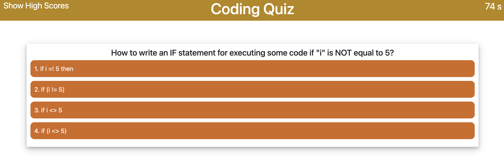

# 04 JavaScript: Coding Quiz

This small application(https://jsharples777.github.io/week-04-homework-nots/index.html) makes use of dynamic Javascript to modify the HTML DOM
to provide the user with a randomised list of questions relating to Javascript, and three or more answers, only one of which is correct.  Getting a question wrong, will give a time penalty.

At the end of the quiz the user may (optionally) give their name/initials to save the score.

The user can see previous high scores, and reset that list if desired.

## User Story

```
AS A coding boot camp student
I WANT to take a timed quiz on JavaScript fundamentals that stores high scores
SO THAT I can gauge my progress compared to my peers
```

## Acceptance Criteria

```
GIVEN I am taking a code quiz
WHEN I click the start button
THEN a timer starts and I am presented with a question
WHEN I answer a question
THEN I am presented with another question
WHEN I answer a question incorrectly
THEN time is subtracted from the clock
WHEN all questions are answered or the timer reaches 0
THEN the game is over
WHEN the game is over
THEN I can save my initials and my score
```

## Mock-Up

The following screenshot demonstrates the application functionality:


